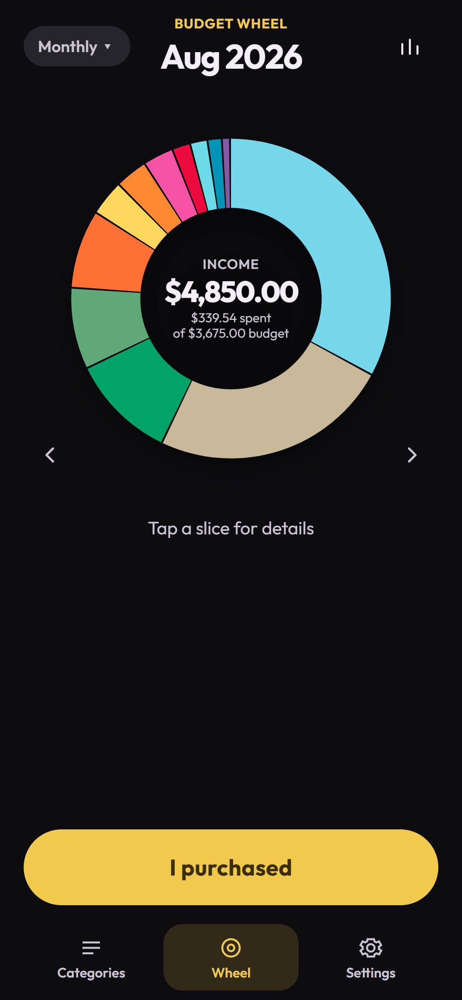
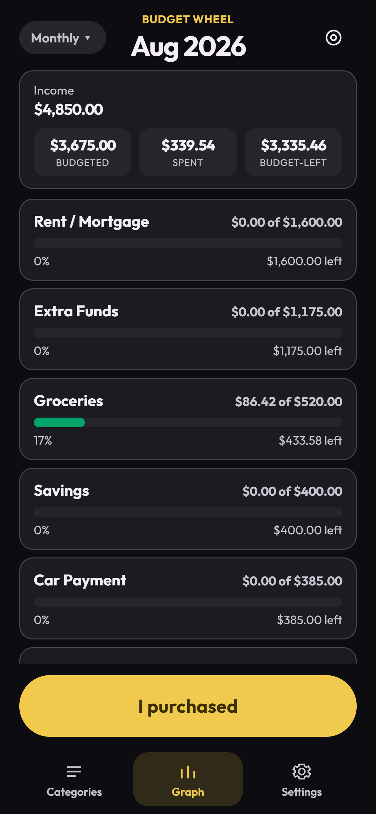

# Budget Wheel

On-device budgeting for Android. Start with real take-home pay, then put every dollar on a wheel.

The app and home-screen widget share one budget on the device. There is no account and no server. Nothing is uploaded.

<p>
  
  
</p>

## What it does

- **Income first.** Salary or hourly, US state tax estimate you can override, extra income, and (for hourly) which weekday you get paid. A month with five paydays shows five paychecks; salary is unchanged.
- **A wheel of every dollar.** Each slice is a category. Unassigned take-home is Extra Funds, not a second budget.
- **Graph of the same month.** Income, budgeted, and spent, then money-left, budget-left, and out of budget.
- **Home-screen widget.** Compact 2×2 or wider 4×2. One-time Play unlock. Log a purchase without opening the app.
- **History you own.** Closed months, quarters, and years stay on the device. Export a PDF or a wheel PNG plus CSV.
- **Dark, Light, or System.** Layout clears the camera hole, clock, and nav bar.

Take-home is a planning estimate (single filer, standard deduction). It is not tax advice.

## Stack

| Layer | Tech |
| --- | --- |
| UI | TypeScript, Vite, custom CSS in an Android WebView |
| Android | Kotlin — WebView host, App Widget, Play Billing |
| Data | Local JSON on the device. No backend. |
| Export | `pdf-lib` for history PDFs |

## Layout

```
src/            WebView app
  screens/      onboarding, home wheel/graph, settings, widget preview
  lib/          income, tax estimate, categories, history, PDF/CSV export
  store.ts      in-memory state and persist
android/        Kotlin host, widget, billing
store/          Play listing copy, privacy, screenshots
scripts/        calendar/payday checks and smokes
```

The WebView writes JSON; `BudgetStore` in Kotlin reads the same file so the widget stays in sync.

## Run locally

```bash
npm install
npm run dev
```

## Tests

```bash
npm run test:calendar
```

Payday weekday counts, leap years, and month/quarter/year ids.

## Android release

1. Copy `android/keystore.properties.example` to `android/keystore.properties` and fill in your upload keystore.
2. Place the keystore file next to it. Do not commit either file.
3. Build:

```bash
npm run bundle:android
```

The signed bundle is written to `android/app/build/outputs/bundle/release/app-release.aab`.

## Play Store kit

Copy in `store/`: listing text, privacy policy, data-safety answers, in-app product copy, icon, feature graphic, and screenshots.

## Privacy

Income, categories, and purchases stay on this device. The Android app does not request the `INTERNET` permission.

- Policy in this repo: [store/privacy.html](store/privacy.html)
- Hosted policy: [idesole.github.io/budgetwheel-privacy](https://idesole.github.io/budgetwheel-privacy/)

## License and copyright

Copyright (c) 2026 iDesole. All rights reserved.

This repository is public so the project can be reviewed. It is **not** open source. See [LICENSE](LICENSE).

Outfit is included under the SIL Open Font License, Version 1.1. See [NOTICE](NOTICE) and [public/fonts/OFL.txt](public/fonts/OFL.txt).
